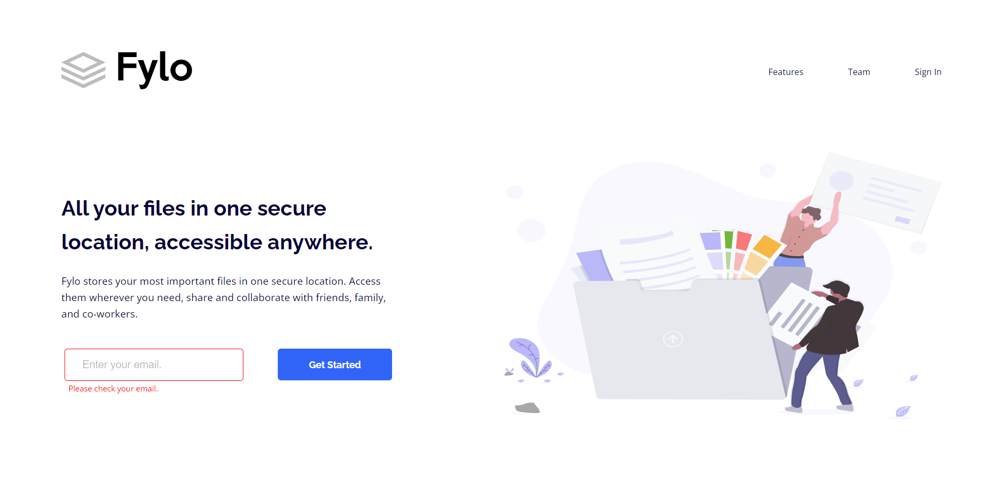

# Frontend Mentor - Fylo landing page with two column layout solution

This is a solution to the [Fylo landing page with two column layout challenge on Frontend Mentor](https://www.frontendmentor.io/challenges/fylo-landing-page-with-two-column-layout-5ca5ef041e82137ec91a50f5). Frontend Mentor challenges help you improve your coding skills by building realistic projects. 

## Table of contents

- [Overview](#overview)
  - [The challenge](#the-challenge)
  - [Screenshot](#screenshot)
  - [Built with](#built-with)
- [Author](#author)
 

**Note: Delete this note and update the table of contents based on what sections you keep.**

## Overview

### The challenge

Users should be able to:

- View the optimal layout for the site depending on their device's screen size
- See hover states for all interactive elements on the page

### Screenshot

 
 

## My process

### Built with
 - HTML5
 - CSS3 
 - SASS 
 
 
## Author
 
- Frontend Mentor - [AbderrahmaneGuerinik](https://www.frontendmentor.io/profile/AbderrahmaneGuerinik)
- LinkedIn - [Abderrahmane Guerinik](https://www.linkedin.com/in/abderrahmane-guerinik-760847279/)

 
